<a name="readme-top"></a>

<div align="center">

<!-- 
# INVESTIGAÇÃO
-->

# 

</div>

# Sistema para Gestão de Reservas do Cowork Fundão

## Resumo

<table>
<tr>
<td>

>  A minha jornada começou pela escolha das funcionalidades que seriam
implementadas na aplicação e como estas poderiam, ou não, influenciar a
experiência da comunidade do Cowork Fundão. A minha maior preocupação
foi criar uma aplicação acessível e apelativa para todos os membros e inseri-lo
no contexto à qual a aplicação estava destinada. Ao mesmo tempo, queria
que a aplicação fosse, igualmente, apelativa a possíveis futuros clientes que
quisessem alugar umespaço de trabalho.
A nossa aplicação permite o registo de utilizadores, realizar Visitas, Reservas
e muito mais. Adicionalmente, estão disponíveis funcionalidades de
administração para permitir aos funcionários o controlo dos dados.
Para aliciar a uma nova visita à aplicação por parte dos utilizadores, foi criada
uma Landing Page, esta procura estimular o espírito de trabalho e atrair
os diversos utilizadores. Além do Sistema de reservas, para todos os utilizadores
(registados ou não) que acederem à aplicação, existe uma funcionalidade
que permite agendar uma visita ao espaço e ficar a conhecer um pouco melhor
todas as ofertas que abrangem este espaço de coworking. Aspeto este que
impulsiona a captação de mais clientes para a plataforma, por ser possível a
criação de um espírito de comunidade e aproximação.
No final deste projeto posso observar que os objetivos iniciais foram cumpridos.
Consegui criar uma Aplicação Multiplataforma dedicada ao Agendamento
de Espaços com auxílio de uma planta e, através da ludificação, consegui
otimizar o sistema de reservas de forma a captar o interesse dos utilizadores
e mantê-los fidelizados à aplicação.
Desenvolvi um Software moderno, que caminha em busca da ética que
hoje progride, dar e receber, ir ao encontro das burocracias sem esquecer o
utilizador. A minha aplicação visa, não só, o rendimento do tempo e promoção
da ética, mas também oferecer uma novidade ao mercado.

</td>
</tr>
</table>

### Ferramentas e Tecnologias

[![JavaScript][JavaScript]][JavaScript-url] [![Figma][Figma]][Figma-url]

<!-- 
[![C++][C++]][C++-url] [![JetBrains][JetBrains]][JetBrains-url] [![LaTeX][LaTeX]][LaTeX-url] [![Overleaf][Overleaf]][Overleaf-url]

[![Java][Java]][Java-url] [![JavaFX][JavaFX]][JavaFX-url] [![NetBeans][NetBeans]][NetBeans-url] [![Spring][Spring]][Spring-url] [![PostgreSQL][PostgreSQL]][PostgreSQL-url] [![MySQL][MySQL]][MySQL-url] [![SQLite][SQLite]][SQLite-url] [![Oracle][Oracle]][Oracle-url] [![Microsoft-SQL-Server][Microsoft-SQL-Server]][Microsoft-SQL-Server-url] [![LaTeX][LaTeX]][LaTeX-url] [![Overleaf][Overleaf]][Overleaf-url]
 
[![Cisco][Cisco]][Cisco-url] [![Linux][Linux]][Linux-url] [![LaTeX][LaTeX]][LaTeX-url] [![Overleaf][Overleaf]][Overleaf-url]

[![OCaml][OCaml]][OCaml-url] [![JetBrains][JetBrains]][JetBrains-url]

[![Assembly][Assembly]][Assembly-url] [![logisim-evolution][logisim-evolution]][logisim-evolution-url]

[![C++][C++]][C++-url] [![VS-Code][VS-Code]][VS-Code-url] [![LaTeX][LaTeX]][LaTeX-url] [![Makefile][Makefile]][Makefile-url]

[![Next][Next.js]][Next-url] [![React][React.js]][React-url] [![Bootstrap][Bootstrap.com]][Bootstrap-url] [![JQuery][JQuery.com]][JQuery-url]
-->

### Repositório GitHub

Após a entrega deste projeto ficará público :  https://github.com/tiago-barreiros/Cowork-Fundao

## Aplicação

### Página de Login

<div align="center">


</div>

### Página de Registo

<div align="center">

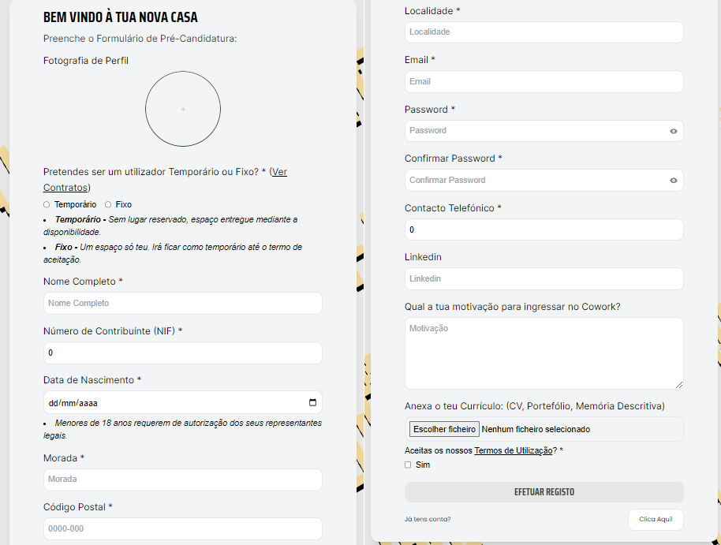

</div>

### Recuperar Password

<div align="center">

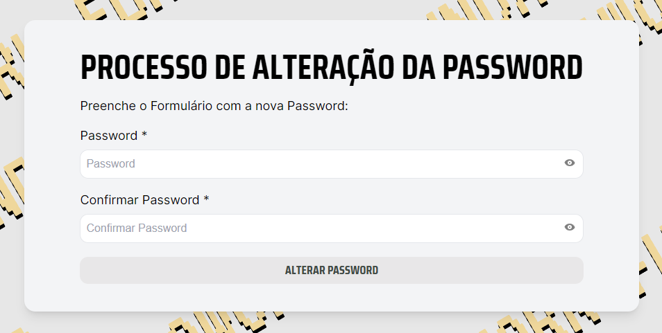

</div>

### Landing Page

<div align="center">

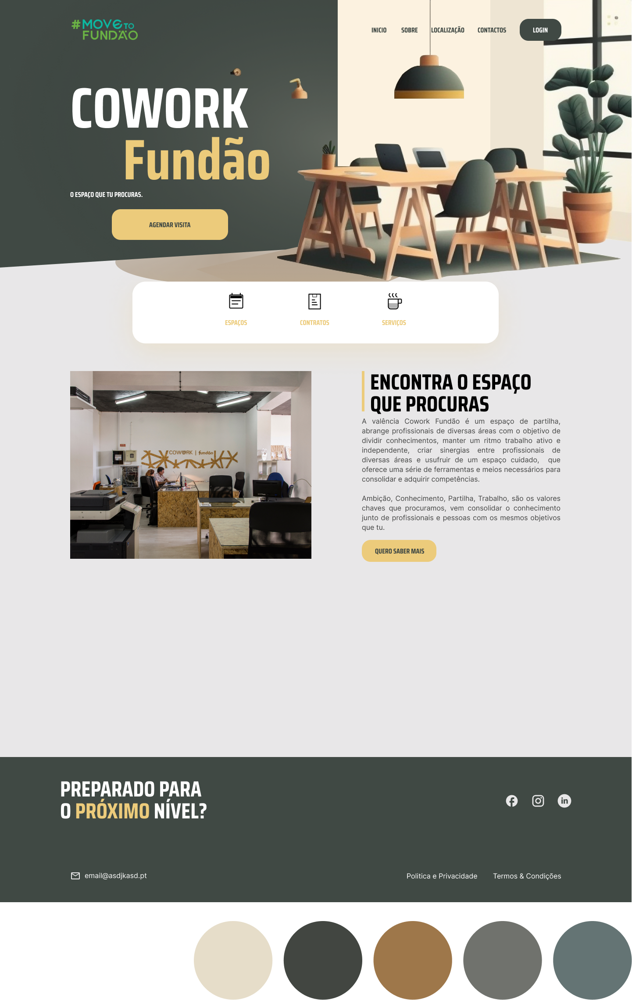

</div>

### Contratos

<div align="center">

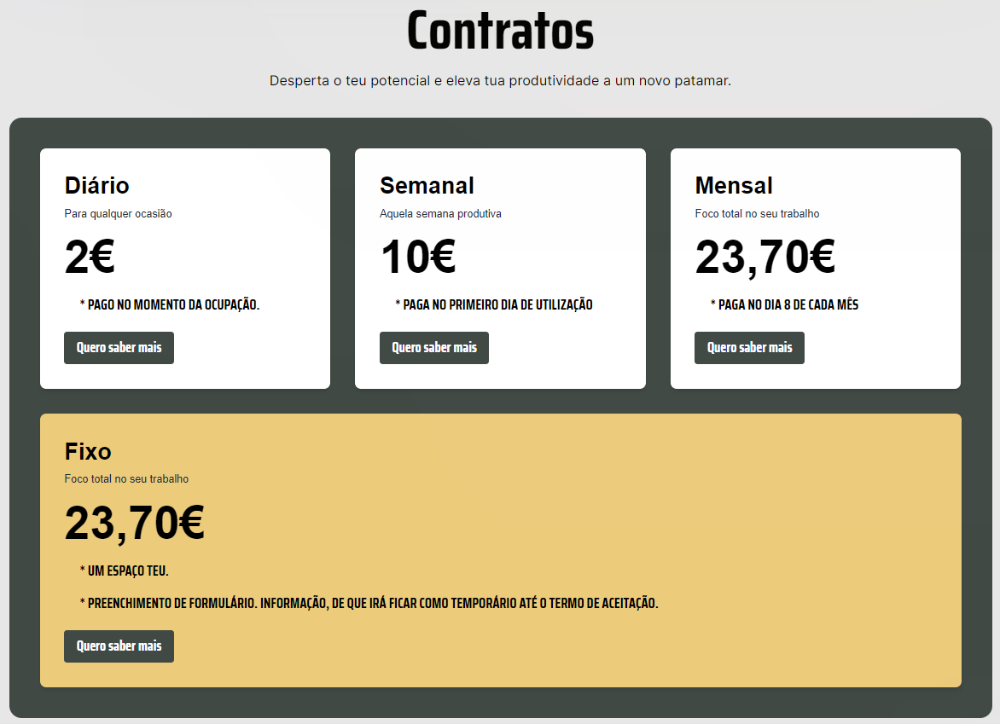

</div>

### Feedbacks

<div align="center">

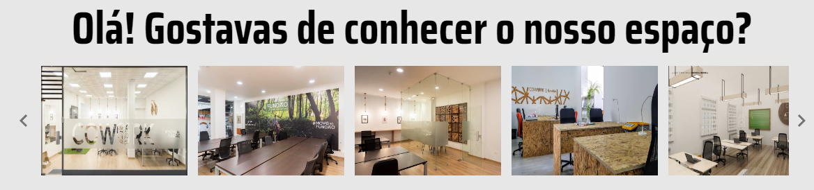

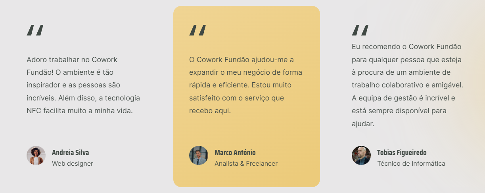

</div>

### Página Pessoal

<div align="center">


</div>

### Reservar

<div align="center">

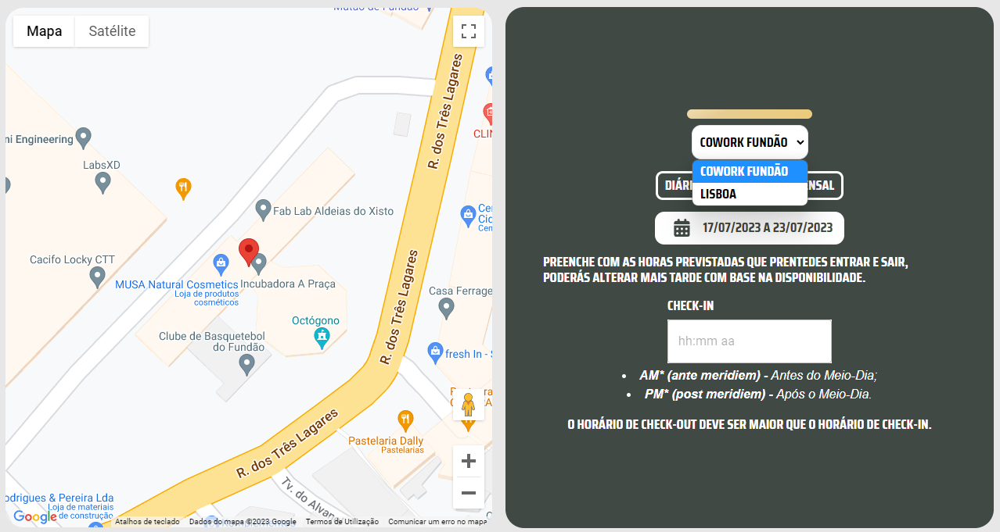

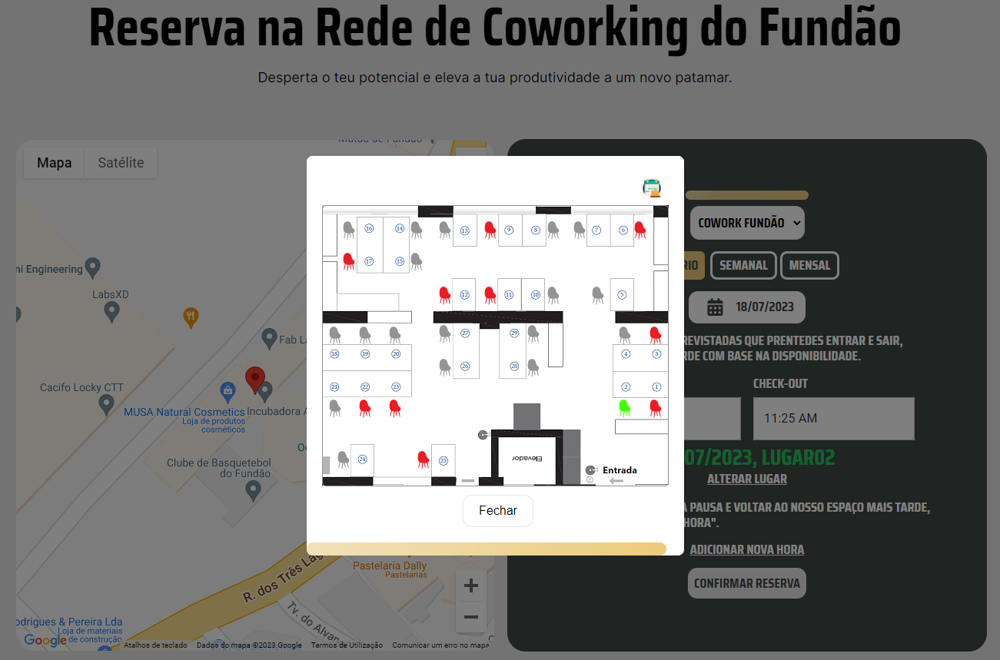

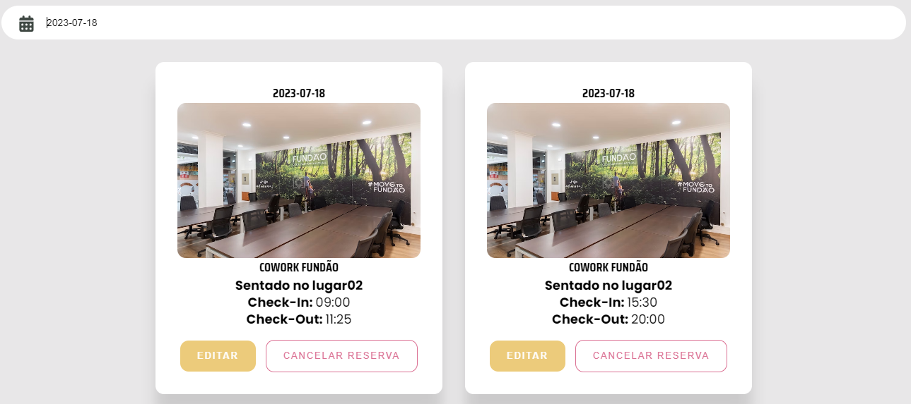

</div>

### Calendário

<div align="center">

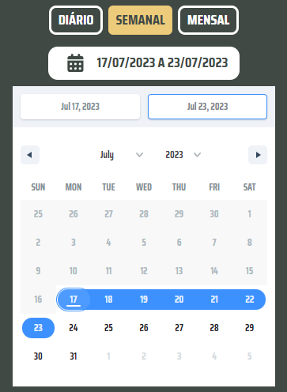

</div>

### Planta do Cowork

<div align="center">

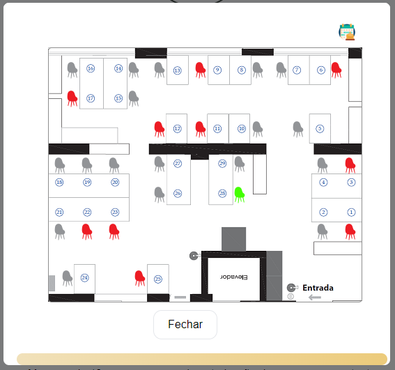

</div>

### Ambiente da Administração

<div align="center">

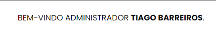

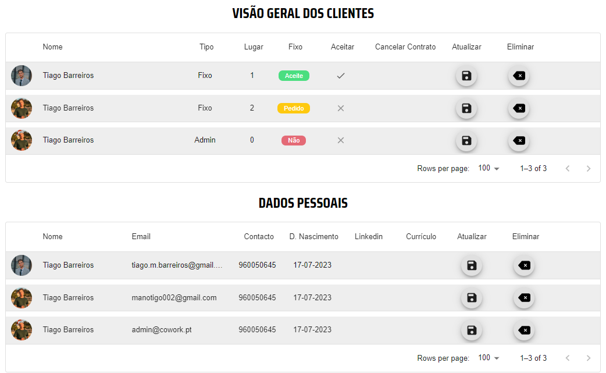

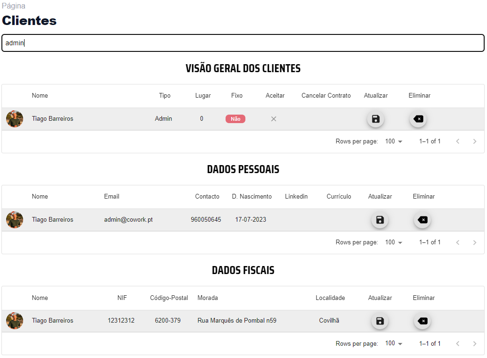

</div>

### Alguns Recursos

<div align="center">


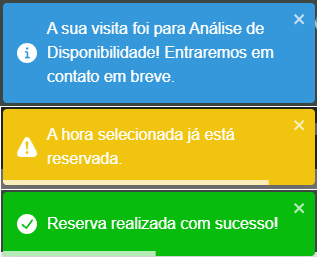

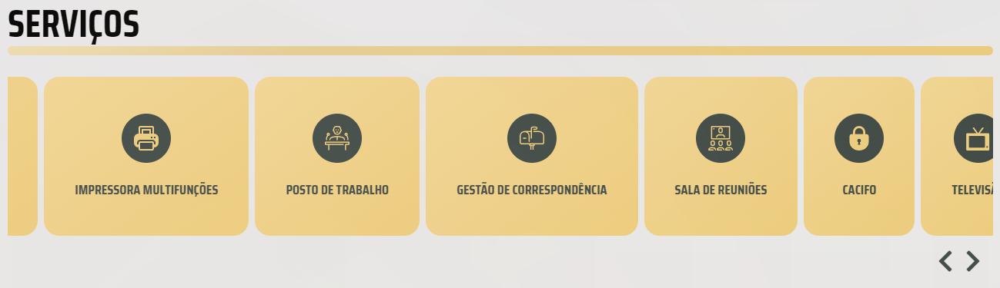

</div>

<!-- 

## Aplicação

### Header

<div align="center">


</div>

### Notícias

<div align="center">

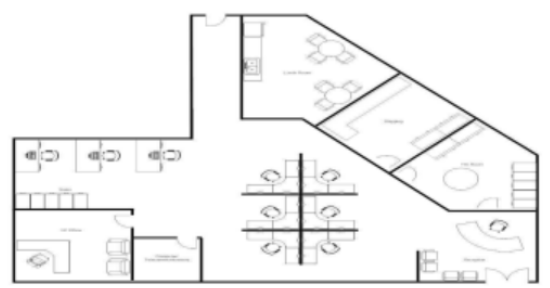

</div>

### Contactos

<div align="center">


</div>

### Footer

<div align="center">

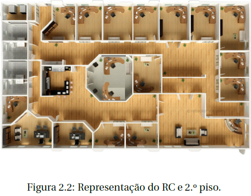

</div>

### Página de Login

<div align="center">

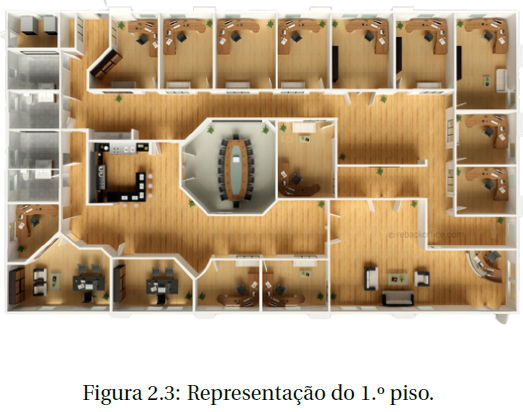

</div>

### Página de Registo

<div align="center">

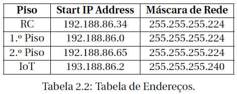

</div>

### Pedido de Voluntariado

<div align="center">

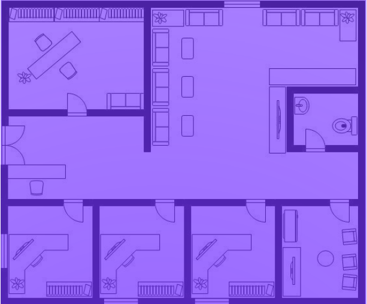

</div>

### Reportar Incêndio

<div align="center">

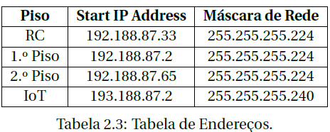

</div>

### Menu introdutório
<div align="center">


</div>


### Operações sobre os Livros
<div align="center">


</div>

### Operações sobre os Clientes
<div align="center">


</div>

### Operações sobre as Encomendas
<div align="center">


</div>


### Página de Login


### Página de Registo


### Recuperar Password


### Landing Page


### Contratos


### Feedbacks


### Página Pessoal


### Reservar


### Calendário


### Planta do Cowork


### Ambiente da Administração


### Alguns Recursos


-->


### Como usar executar App?
<!-- 
- O acesso ao SQL Server é feito através de um protocolo presente na Network
  Configuration, onde está encapsulado o protocolo TCP/IP.
  Este é um modelo robusto, rápido e confiável, sendo na atualidade praticamente
  indispensável.

- Deverá ser compilado utilizando o comando:
   ```sh
   gcc -o qqsm main main.c -Wall -std=c99
   ```
-->

- Acede ao website no URL de um browser: https://cowork-fundao.web.app/

## Conclusões Principais

<table>
<tr>
<td>

>  Com a realização deste projeto foi possível criar um Sistema para Gestão
de Reservas do Cowork Fundão de forma realista, detalhada e intuitiva. O objetivo
estipulado inicialmente, visava uma solução para o Sistema de Reservas
dos Espaços, Autenticação de Utilizadores e Back-Office, todos estes introduzidos
numa AplicaçãoMultiplataforma com Landing Page.

> Este trabalho permitiu colocar à prova diversas aprendizagens e conceitos
obtidos no decorrer da minha licenciatura, gostaria de salientar que o conteúdo
dado na UC Engenharia de Software revelou-se muito útil, pois facilitou
bastante o trabalho, organização das tarefas e criação de diagramas. A
existência desta aprendizagem foi fulcral, pois, isto aumentou imenso a minha
produtividade e garantiu que o trabalho fosse completado de maneira
eficiente e a tempo. Enquanto o trabalho ia sendo desenvolvido, a revisão e
reflexão daquilo que já tinha sido realizado, foi particularmente importante
para expandir a minha visão, procurar o que ainda podia ser melhorado, alcançado
e também garantir uma maior flexibilidade caso alguma circunstância
ou prioridade mudasse. Um dos desafios que encontrei foi a falta de conhecimento
sobre a linguagem de programação e o domínio de Aplicações
Multiplataforma.

> Ao longo deste trabalho, após inúmeros dias de treino e prática da linguagem,
há espera de uma melhoria significante, pude concluir que o que absorvi
mais deste trabalho foram os conceitos que o próprio induziu em transmitir,
a vontade de adquirir conhecimento e novas skills de programação, no fundo,
ensinaram-me a adaptar-me.

> Não interessa (como quem diz) a topologia da rede, mais pormenores menos pormenores, o importante é nós percebermos o que é pretendido pelo
cliente e remar na sua direção. Tive de me adaptar aos pedidos e também
aos contratos, tive de transformar um sistema analógico em digital. Com o
passar do tempo, é importante saber como os dados se comportam, na funcionalidade
das reservas tive um longo desafio, para além de um sistema otimizado
no sentido dos lucros (i.e., limitar o agendamento por horas), também
a implementação da planta com essas mesmas verificações foi uma abordagem
que tive e considero essa completa. Conclui que, um número demasiado
curto de "parâmetros" pode não ser suficiente para modelar a solução desejada,
mas um valor demasiado alto pode levar a um sobre-ajustamento. Claramente,
existem muitas (infinitas) soluções potenciais para o problema. Encontrar
o melhor modelo é um problema de otimização, mas qual deles será
o melhor?

> O termo otimização refere-se a encontrar os parâmetros de um modelo
para obter os melhores valores de saída. Na prática, refere-se à maximização/minimização de uma função objetivo, através da variação dos valores possíveis
dos parâmetros. Todos os dados analisados ajudaram-me a concluir que
a sua quantidade e diversidade é importante, mas também a qualidade e o
caminho percorrido, pois este último pode-nos distanciar do objetivo.

> Aprendi bastante com este trabalho, foi desafiador, não no sentido de "ah,
há muitas soluções na internet", mas sim no sentido em que é pegar no problema,
perceber o problema e tentar por nós mesmos, situação a situação,
encontrar uma solução para o mesmo, tentar moldá-lo e aprimorar. Muitas
vezes é nestes trabalhos que aprendemos muita coisa, ser engenheiro é isto,
resolver o problema e encontrar soluções.

> Com isto, pretendo passar a minha ideia acerca do que foi desenvolvido,
há centenas de soluções para um problema, mas essas soluções apenas se
resolvem com pesquisa, trabalho, investigação e procura. Ganhei uma maior
aptidão para trabalhar em equipa, elaborar relatórios técnicos, bem como a
agilidade necessária para programar e proceder à sua pesquisa.

> Nada disto seria possível sem o conhecimento obtido ao longo da minha
licenciatura, as aulas mostraram-se objetivas e auto-contidas, o que permitiu
criar uma ideia clara sobre o longo trabalho que tinha pela frente e como
iria proceder à sua realização. Felizmente consegui resolver, com sucesso, todos
os erros que captava, produzi um programa que faz exatamente o que é
pedido, de forma eficaz, contida, evitando erros do utilizador e ajudando o
mesmo com avisos, caso este se encontre um pouco perdido.

> A escrita em LATEX, permitiu-me rever as competências adquiridas no primeiro
ano, em torno da escrita e embelezamento de Relatórios Técnicos, definida
como meta na UC Laboratórios de Programação. Permitiu-me apresentar
um relatório bem estruturado e devidamente "linkado".

> Por fim, este projeto também me permitiu adquirir novas habilidades unipessoais
queme serão muito úteis no futuro.


</td>
</tr>
</table>

## Trabalho Futuro

<table>
<tr>
<td>

>  Versões futuras da minha aplicação poderiam conter a introdução de gráficos
de estatística no perfil do utilizador, permitindo a este analisar o seu
tempo de ocupação e produtividade. Como um bom ponto de partida, oferecer
ao administrador a oportunidade e o direito de poder personalizar a
planta e funcionalidades que permitam administrar a mesma. Num futuro
mais promissor, um chat de conversação seria uma boa ideia, focado em melhorar
o contacto cliente-funcionário emaior celeridade de resposta.

> Pretendo anexar gráficos estatísticos no painel de administração, gráficos
estes fruto das informações fornecidas pelos utilizadores, como forma de permitir
uma apreciação visual e critica, por parte do staff. Melhorar a capacidade
de raciocinar sobre uma potencial ação antes de a executar, melhorar
a análise dos estados, estabelecer objetivos próprios e inferir novos conhecimentos,
além disso, existemoutras áreas que podem ser exploradas no futuro.

> Com vista a englobar todo o projeto, trabalharia focado em transformar
tudo o que é analógico no digital, tornar ideias em algo real, algo moderno,
promover a sustentabilidade e melhorar o Sistema.

> Trabalhar no registo de passwords mais complexas, evitar email temporários,
seriam funcionalidades simples de implementar e já contenho todos
os recursos para as realizar. No projeto, criei uma simulação do sistema NFC
para gerir as entradas e saídas dos clientes, existiam certos pormenores que
não tinha conhecimento, mas com alguma pesquisa e vontade, foi possível
aprender bastante e posso dizer agora, após a realização deste projeto, que
sei muito mais sobre este tema e sinto-me pronto para trabalhar nele. Num
futuro próximo, desenvolver um sistema que permita implementar esta funcionalidade
será crucial, devido a todo o apoio que este pode fornecer.

> É importante lembrar que o conhecimento sobre este tema encontra-se
em constante evolução nos dias de hoje, portanto, é possível que haja ainda
mais detalhes e informações que possam ser adicionados à representação criada
neste projeto.

> Depois de serem efetuados testes reais, é importante continuar a pesquisar
e a explorar novas técnicas e tecnologias para poder criar soluções ainda
mais detalhadas e realistas, com objetivo de conseguir implementar um trabalho
mais interativo e atraente.

</td>
</tr>
</table>

## Documentação

- [React](https://reactjs.org/docs/getting-started.html)
- [react-router-dom](https://reactrouter.com/web/guides/quick-start)
- [npm](https://www.npmjs.com/)
- [DataPicker](https://hypeserver.github.io/react-date-range/)
- [Date and Time Pickers - Validation](https://mui.com/x/react-date-pickers/validation/)
- [headless UI](https://headlessui.com/)
- [tailwindcss](https://v2.tailwindcss.com/docs/installation)
- [Firebase](https://firebase.google.com/docs)

> A restante documentação encontra-se no extenso Relatório Técnico estruturado mediante o desenvolvimento deste projeto.


<!-- 
- [C++](https://www.cplusplus.com/doc/)
- [JetBrains](https://www.jetbrains.com/help/)
- [LaTeX](https://www.latex-project.org/help/documentation/)
- [Overleaf](https://www.overleaf.com/learn)
- [React](https://reactjs.org/docs/getting-started.html)
- [react-router-dom](https://reactrouter.com/web/guides/quick-start)
- [npm](https://www.npmjs.com/)
- [DataPicker](https://hypeserver.github.io/react-date-range/)
- [Date and Time Pickers - Validation](https://mui.com/x/react-date-pickers/validation/)
- [headless UI](https://headlessui.com/)
- [tailwindcss](https://v2.tailwindcss.com/docs/installation)
- [Firebase](https://firebase.google.com/docs)

> A restante documentação encontra-se no extenso Relatório Técnico estruturado mediante o desenvolvimento deste projeto.
-->

## Equipa de Desenvolvimento

[](https://github.com/tiago-barreiros)
----------------------------------------------------------------------------------------------------------------------
[Tiago Barreiros](https://github.com/tiago-barreiros)

# Orientação
## [Prof. Doutor Bruno M. C. Silva](https://www.cienciavitae.pt/A710-2809-AB40)

## *Projeto* @[Universidade da Beira Interior](https://www.ubi.pt/).

<!-- 
### Installation

_Below is an example of how you can instruct your audience on installing and setting up your app. This template doesn't rely on any external dependencies or services._

1. Get a free API Key at [https://example.com](https://example.com)
2. Clone the repo
   ```sh
   git clone https://github.com/your_username_/Project-Name.git
   ```
3. Install NPM packages
   ```sh
   npm install
   ```
4. Enter your API in `config.js`
   ```js
   const API_KEY = 'ENTER YOUR API';
   ```

<p align="right">(<a href="#readme-top">back to top</a>)</p>
-->

<!-- LICENSE -->
## License

Distributed under the MIT License. See `LICENSE.txt` for more information.

<!-- CONTACT -->
## Contact

<div> 
   <a href = "mailto:tiago.m.barreiros@gmail.com"></a>
  <a href="https://www.linkedin.com/in/tiago-barreiros/" target="_blank"></a> 
   <a href="https://discord.gg/537381363486031873" target="_blank"></a>
</div>

<p align="right">(<a href="#readme-top">back to top</a>)</p>

<!-- MARKDOWN LINKS & IMAGES -->
<!-- https://www.markdownguide.org/basic-syntax/#reference-style-links -->
[contributors-shield]: https://img.shields.io/github/contributors/othneildrew/Best-README-Template.svg?style=for-the-badge
[contributors-url]: https://github.com/othneildrew/Best-README-Template/graphs/contributors
[forks-shield]: https://img.shields.io/github/forks/othneildrew/Best-README-Template.svg?style=for-the-badge
[forks-url]: https://github.com/othneildrew/Best-README-Template/network/members
[stars-shield]: https://img.shields.io/github/stars/othneildrew/Best-README-Template.svg?style=for-the-badge
[stars-url]: https://github.com/othneildrew/Best-README-Template/stargazers
[issues-shield]: https://img.shields.io/github/issues/othneildrew/Best-README-Template.svg?style=for-the-badge
[issues-url]: https://github.com/othneildrew/Best-README-Template/issues
[license-shield]: https://img.shields.io/github/license/othneildrew/Best-README-Template.svg?style=for-the-badge
[license-url]: https://github.com/othneildrew/Best-README-Template/blob/master/LICENSE.txt
[linkedin-shield]: https://img.shields.io/badge/-LinkedIn-black.svg?style=for-the-badge&logo=linkedin&colorB=555
[linkedin-url]: https://linkedin.com/in/othneildrew
[Next.js]: https://img.shields.io/badge/next.js-000000?style=for-the-badge&logo=nextdotjs&logoColor=white
[Next-url]: https://nextjs.org/
[React.js]: https://img.shields.io/badge/React-20232A?style=for-the-badge&logo=react&logoColor=61DAFB
[React-url]: https://reactjs.org/
[C++]: https://img.shields.io/badge/C++-00599C?style=for-the-badge&logo=cplusplus&logoColor=white
[C++-url]: https://www.cplusplus.com/
[C]: https://img.shields.io/badge/C-00599C?style=for-the-badge&logo=c&logoColor=white
[C-url]: https://www.cprogramming.com/
[C#]: https://img.shields.io/badge/C%23-239120?style=for-the-badge&logo=csharp&logoColor=white
[C#-url]: https://docs.microsoft.com/en-us/dotnet/csharp/
[VS-Code]: https://img.shields.io/badge/VS_Code-0078D4?style=for-the-badge&logo=visualstudiocode&logoColor=white
[VS-Code-url]: https://code.visualstudio.com/
[Vue.js]: https://img.shields.io/badge/Vue.js-35495E?style=for-the-badge&logo=vuedotjs&logoColor=4FC08D
[Vue-url]: https://vuejs.org/
[Angular.io]: https://img.shields.io/badge/Angular-DD0031?style=for-the-badge&logo=angular&logoColor=white
[Angular-url]: https://angular.io/
[Svelte.dev]: https://img.shields.io/badge/Svelte-4A4A55?style=for-the-badge&logo=svelte&logoColor=FF3E00
[Svelte-url]: https://svelte.dev/
[Laravel.com]: https://img.shields.io/badge/Laravel-FF2D20?style=for-the-badge&logo=laravel&logoColor=white
[Laravel-url]: https://laravel.com
[Bootstrap.com]: https://img.shields.io/badge/Bootstrap-563D7C?style=for-the-badge&logo=bootstrap&logoColor=white
[Bootstrap-url]: https://getbootstrap.com
[JQuery.com]: https://img.shields.io/badge/jQuery-0769AD?style=for-the-badge&logo=jquery&logoColor=white
[JQuery-url]: https://jquery.com
[LaTex]: https://img.shields.io/badge/LaTeX-47A141?style=for-the-badge&logo=latex&logoColor=white
[LaTex-url]: https://www.latex-project.org/
[Makefile]: https://img.shields.io/badge/Makefile-003366?style=for-the-badge&logo=gnu&logoColor=white
[Makefile-url]: https://www.gnu.org/software/make/
[Assembly]: https://img.shields.io/badge/Assembly-000000?style=for-the-badge&logo=assemblyscript&logoColor=white
[Assembly-url]: https://www.assemblyscript.org/
[logisim-evolution]: https://img.shields.io/badge/Logisim_Evolution-FF2D20?style=for-the-badge&logo=logisim&logoColor=white
[logisim-evolution-url]: https://www.logisim.org/
[OCaml]: https://img.shields.io/badge/OCaml-EC6813?style=for-the-badge&logo=ocaml&logoColor=white
[OCaml-url]: https://ocaml.org/
[JetBrains]: https://img.shields.io/badge/JetBrains-000000?style=for-the-badge&logo=jetbrains&logoColor=white
[JetBrains-url]: https://www.jetbrains.com/
[Overleaf]: https://img.shields.io/badge/Overleaf-47A141?style=for-the-badge&logo=overleaf&logoColor=white
[Overleaf-url]: https://www.overleaf.com/
[Linux]: https://img.shields.io/badge/Linux-FCC624?style=for-the-badge&logo=linux&logoColor=black
[Linux-url]: https://www.linux.org/
[Cisco]: https://img.shields.io/badge/Cisco-1BA0D7?style=for-the-badge&logo=cisco&logoColor=white
[Cisco-url]: https://www.cisco.com/
[Arduino]: https://img.shields.io/badge/Arduino-00979D?style=for-the-badge&logo=arduino&logoColor=white
[Arduino-url]: https://www.arduino.cc/
[Scanner]: https://img.shields.io/badge/Scanner-000000?style=for-the-badge&logo=scanner&logoColor=white
[Scanner-url]: https://www.scanner.com/
[Java]: https://img.shields.io/badge/Java-ED8B00?style=for-the-badge&logo=java&logoColor=white
[Java-url]: https://www.java.com/
[JavaFX]: https://img.shields.io/badge/JavaFX-ED8B00?style=for-the-badge&logo=java&logoColor=white
[JavaFX-url]: https://openjfx.io/
[NetBeans]: https://img.shields.io/badge/NetBeans-1B6AC6?style=for-the-badge&logo=apache-netbeans-ide&logoColor=white
[NetBeans-url]: https://netbeans.apache.org/
[Spring]: https://img.shields.io/badge/Spring-6DB33F?style=for-the-badge&logo=spring&logoColor=white
[Spring-url]: https://spring.io/
[PostgreSQL]: https://img.shields.io/badge/PostgreSQL-316192?style=for-the-badge&logo=postgresql&logoColor=white
[PostgreSQL-url]: https://www.postgresql.org/
[MySQL]: https://img.shields.io/badge/MySQL-00000F?style=for-the-badge&logo=mysql&logoColor=white
[MySQL-url]: https://www.mysql.com/
[SQLite]: https://img.shields.io/badge/SQLite-07405E?style=for-the-badge&logo=sqlite&logoColor=white
[SQLite-url]: https://www.sqlite.org/
[Oracle]: https://img.shields.io/badge/Oracle-F80000?style=for-the-badge&logo=oracle&logoColor=white
[Oracle-url]: https://www.oracle.com/
[Microsoft-SQL-Server]: https://img.shields.io/badge/Microsoft_SQL_Server-CC2927?style=for-the-badge&logo=microsoft-sql-server&logoColor=white
[Microsoft-SQL-Server-url]: https://www.microsoft.com/en-us/sql-server
[Python]: https://img.shields.io/badge/Python-3776AB?style=for-the-badge&logo=python&logoColor=white
[Python-url]: https://www.python.org/
[Audacity]: https://img.shields.io/badge/Audacity-0000CC?style=for-the-badge&logo=audacity&logoColor=white
[Audacity-url]: https://www.audacityteam.org/
[Discord]: https://img.shields.io/badge/Discord-7289DA?style=for-the-badge&logo=discord&logoColor=white
[Discord-url]: https://discord.com/
[Swing]: https://img.shields.io/badge/Swing-007396?style=for-the-badge&logo=java&logoColor=white
[Swing-url]: https://docs.oracle.com/javase/tutorial/uiswing/
[FXML]: https://img.shields.io/badge/FXML-007396?style=for-the-badge&logo=java&logoColor=white
[FXML-url]: https://openjfx.io/javadoc/11/javafx.fxml/javafx/fxml/doc-files/introduction_to_fxml.html
[SceneBuilder]: https://img.shields.io/badge/SceneBuilder-007396?style=for-the-badge&logo=java&logoColor=white
[SceneBuilder-url]: https://gluonhq.com/products/scene-builder/
[HTML5]: https://img.shields.io/badge/HTML5-E34F26?style=for-the-badge&logo=html5&logoColor=white
[HTML5-url]: https://developer.mozilla.org/en-US/docs/Web/Guide/HTML/HTML5
[CSS3]: https://img.shields.io/badge/CSS3-1572B6?style=for-the-badge&logo=css3&logoColor=white
[CSS3-url]: https://developer.mozilla.org/en-US/docs/Web/CSS
[PHP]: https://img.shields.io/badge/PHP-777BB4?style=for-the-badge&logo=php&logoColor=white
[PHP-url]: https://www.php.net/
[JavaScript]: https://img.shields.io/badge/JavaScript-F7DF1E?style=for-the-badge&logo=javascript&logoColor=black
[JavaScript-url]: https://developer.mozilla.org/en-US/docs/Web/JavaScript
[TypeScript]: https://img.shields.io/badge/TypeScript-007ACC?style=for-the-badge&logo=typescript&logoColor=white
[TypeScript-url]: https://www.typescriptlang.org/
[React]: https://img.shields.io/badge/React-20232A?style=for-the-badge&logo=react&logoColor=61DAFB
[React-url]: https://reactjs.org/
[Node.js]: https://img.shields.io/badge/Node.js-43853D?style=for-the-badge&logo=node.js&logoColor=white
[Node.js-url]: https://nodejs.org/en/
[GLSL]: https://img.shields.io/badge/GLSL-5586A4?style=for-the-badge&logo=opengl&logoColor=white
[GLSL-url]: https://www.khronos.org/opengl/wiki/OpenGL_Shading_Language
[OpenGL]: https://img.shields.io/badge/OpenGL-5586A4?style=for-the-badge&logo=opengl&logoColor=white
[OpenGL-url]: https://www.opengl.org/
[Visual-Studio]: https://img.shields.io/badge/Visual_Studio-5C2D91?style=for-the-badge&logo=visual-studio&logoColor=white
[Visual-Studio-url]: https://visualstudio.microsoft.com/
[Trello]: https://img.shields.io/badge/Trello-0079BF?style=for-the-badge&logo=trello&logoColor=white
[Trello-url]: https://trello.com/
[Figma]: https://img.shields.io/badge/Figma-F24E1E?style=for-the-badge&logo=figma&logoColor=white
[Figma-url]: https://www.figma.com/
[Creately]: https://img.shields.io/badge/Creately-FF8000?style=for-the-badge&logo=creately&logoColor=white
[Creately-url]: https://creately.com/
[Android-Studio]: https://img.shields.io/badge/Android_Studio-3DDC84?style=for-the-badge&logo=android-studio&logoColor=white
[Android-Studio-url]: https://developer.android.com/studio
[Firebase]: https://img.shields.io/badge/Firebase-FFCA28?style=for-the-badge&logo=firebase&logoColor=white
[Firebase-url]: https://firebase.google.com/
[MySQL-Workbench]: https://img.shields.io/badge/MySQL_Workbench-4479A1?style=for-the-badge&logo=mysql&logoColor=white
[MySQL-Workbench-url]: https://www.mysql.com/products/workbench/
[Jakarta-EE]: https://img.shields.io/badge/Jakarta_EE-007396?style=for-the-badge&logo=java&logoColor=white
[Jakarta-EE-url]: https://jakarta.ee/
